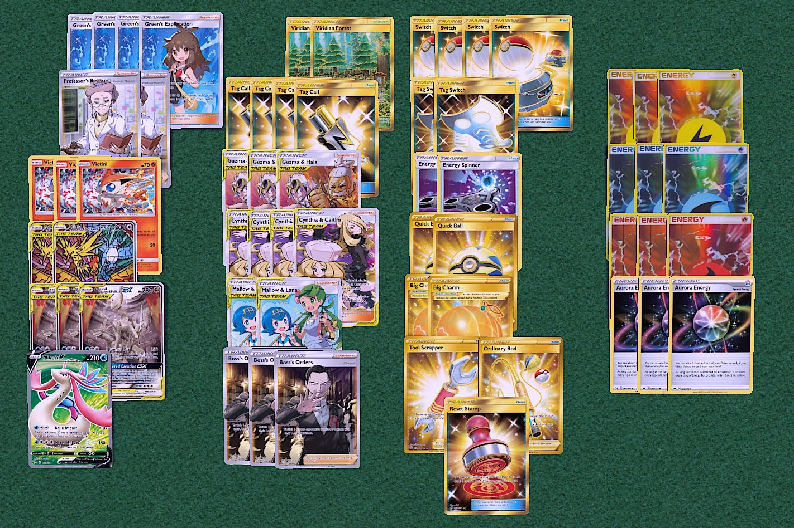
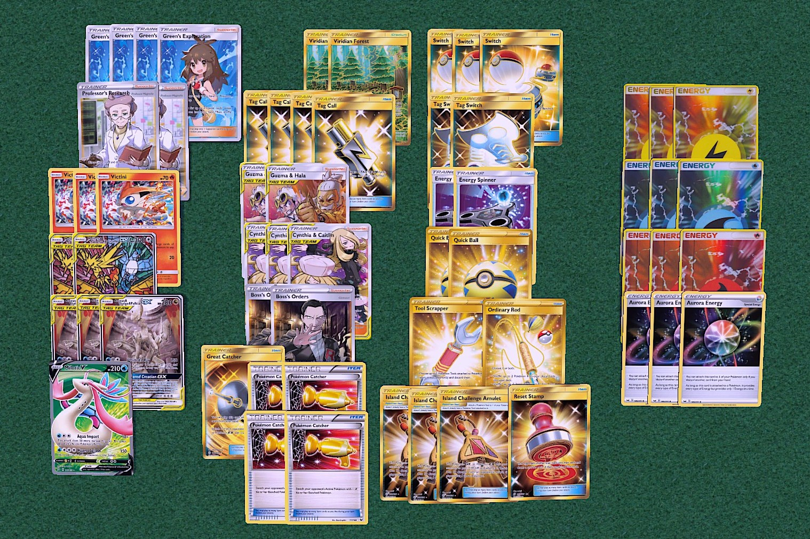

## ADP Birds

[Back](https://joeygaffney.github.io/teamlit/res/decklists)

# Decklist (Vanilla):


# For PTCGO import:
```
Pokemon - 9
3 Arceus & Dialga & Palkia-GX CEC 221
3 Victini UNM 26
2 Moltres & Zapdos & Articuno-GX SMP SM210
1 Milotic V RCL 43

Trainer - 39
2 Professor's Research SSH 178
4 Green's Exploration UNB 175
3 Boss's Orders RCL 154
3 Guzma & Hala CEC 193
4 Cynthia & Caitlin CEC 189
2 Mallow & Lana CEC 198
4 Tag Call CEC 206
2 Big Charm SSH 158
1 Tool Scrapper RCL 168
1 Ordinary Rod SSH 171
1 Reset Stamp UNM 253
2 Viridian Forest TEU 156
2 Quick Ball SSH 179
4 Switch PRC 163
2 Tag Switch UNM 209
2 Energy Spinner UNB 170

Energy - 12
3 Aurora SSH 186
3 Fire SSH R
3 Water SSH W
3 Electric SSH L
```

# Decklist (Flip)

# For PTCGO import:
```
Pokemon - 9
3 Arceus & Dialga & Palkia-GX CEC 221
3 Victini UNM 26
2 Moltres & Zapdos & Articuno-GX SMP SM210
1 Milotic V RCL 43

Trainer - 39
2 Professor's Research SSH 178
4 Green's Exploration UNB 175
2 Boss's Orders RCL 154
2 Guzma & Hala CEC 193
3 Cynthia & Caitlin CEC 189
4 Pokemon Catcher
1 Great Catcher
3 Island Challenge Amulet
4 Tag Call CEC 206
1 Tool Scrapper RCL 168
1 Ordinary Rod SSH 171
1 Reset Stamp UNM 253
2 Viridian Forest TEU 156
2 Quick Ball SSH 179
3 Switch PRC 163
2 Tag Switch UNM 209
2 Energy Spinner UNB 170

Energy - 12
3 Aurora SSH 186
3 Fire SSH R
3 Water SSH W
3 Electric SSH L
```

# Card Choices
## Skeleton
```
Pokemon
2 Arceus & Dialga & Palkia-GX
2 Moltres & Zapdos & Articuno-GX
2 Victini

Trainers
4 Tag Call
3 Guzma & Hala
3 Cynthia & Caitlin
3 Green's Exploration

Energy
3 Aurora
2 Water
2 Fire
2 Lightning
```

## Discussion
### Pokemon
- ADP is pretty strong. Taking an extra prize is always going to be good, you steal advantage even though it takes an extra turn. The only way for your opponent to capitalize on it is to deny energy by taking early KOs on ADP. It is slightly more difficult with 280HP.
- Birds is the main attacker. It allows you to run a green's engine which can be really good at times. 240 (after Altered Creation GX) is enough to KO a lot of things to net you 3 prizes.
- Victini allows you to accelerate energy on turn 1. This opens up your options to either Altered Creation turn 2 or Ultimate Ray to get early damage advantage and overwhelm with energy attachments.
- Milotic V makes Centiskorch a really easy matchup. You can also pull it out of nowhere with Green's into Tag Switch + Switch with an energy attachment.

### Trainers
- **Supporters**
    - Green's is a really good supporter. You can almost always play it instead of a Professor's Research and get a better outcome. 
    - Tag Team Supporters complement the Tag Call Engine.
- **Items**
    - Tag Call is self-explanatory.
    - 2 Quick Ball is usually fine when you run 4 Green's and 4 Tag Calls. If you don't start Victini you can Green's for Switch and Quick Ball. Otherwise, just attach to ADP and you're still fine.
    - 4 Pokemon Catcher (Flip Version) is absolutely insane at times. Being able to Green's into two catcher for a 75% chance of gust is a valid play, so is getting the one item you need to attack and a single Catcher for a 50% chance to put yourself in a super winning position. You still run Boss's Orders because a guaranteed gust is always better. 
    - Island Challenge Amulet (Flip Version) is to try and force your opponent into KOing 3 Tag Teams. You only need to use 1 if you do not play down Victini in a game. It will buy you the turn to attach energy to set up for the 3 prize steal on that Dedenne-GX or Crobat V.
- **Stadiums**
    - Viridian Forest is an okay choice over swell. Searching for the correct energy type (usually fire for victini turn 1) is sometimes important.

### Energy
- 3 Aurora seems like a fine split. You usually search them out with Guzma & Hala and they are only needed for ADP. 
- 3/3/3 Energy split just to make sure you don't prize all of one type.

### Potential Techs
- *Mawile-GX* lets you punish people who hold their GX/V Pokemon.
- *Turbo Patch/Energy Switch* is honestly not good in this. It is good in ADPZ though. The combo is much harder to pull off here.

[Back](https://joeygaffney.github.io/teamlit/res/decklists)