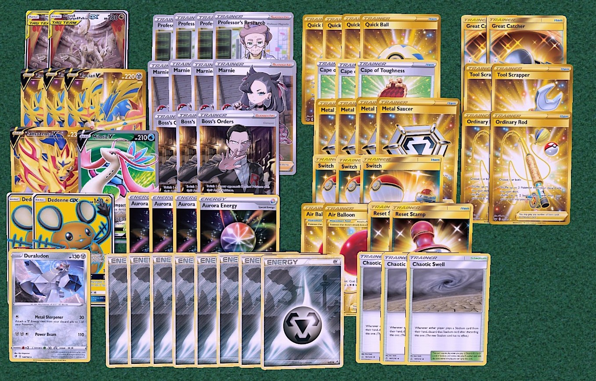
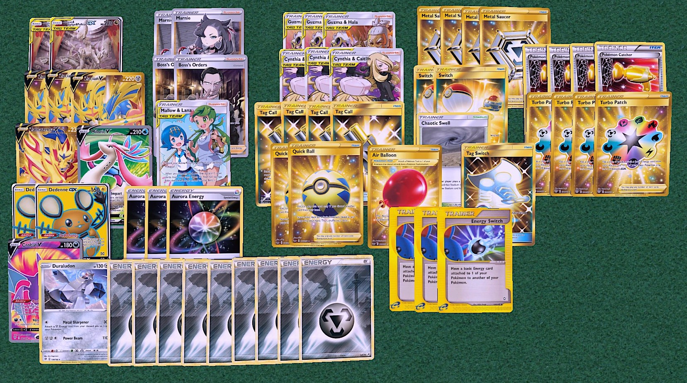

## ADPZ

[Back](https://joeygaffney.github.io/teamlit/res/decklists)

# Decklist (Vanilla):


# For PTCGO import:
```
Pokemon - 10
2 Arceus & Dialga & Palkia-GX CEC 221
3 Zacian V SSH 138
1 Zamazenta V SSH 212
1 Milotic V RCL 43
2 Dedenne-GX UNB 195
1 Duraludon RCL 138

Trainer - 38
4 Professor's Research SSH 178
4 Marnie SSH 169
3 Boss's Orders RCL 154
4 Quick Ball SSH 179
3 Cape of Toughness DAA 160
4 Metal Saucer SSH 170
3 Switch PRC 163
2 Air Balloon SSH 156
2 Reset Stamp UNM 253
2 Great Catcher CEC 192
2 Tool Scrapper RCL 168
2 Ordinary Rod SSH 171
3 Chaotic Swell CEC 187

Energy - 12
4 Aurora Energy SSH 186
8 Metal SSH M
```

# Decklist (Flip):


# For PTCGO import:
```
Pokemon - 11
2 Arceus & Dialga & Palkia-GX CEC 221
3 Zacian V SSH 138
1 Zamazenta V SSH 212
1 Milotic V RCL 43
2 Dedenne-GX UNB 195
1 Crobat V DAA 104
1 Duraludon RCL 138

Trainer - 37
3 Guzma & Hala
3 Cynthia & Caitlin
1 Mallow & Lana
4 Tag Call
4 Turbo Patch
4 Pokemon Catcher
3 Energy Switch
1 Tag Switch
2 Marnie SSH 169
2 Boss's Orders RCL 154
2 Quick Ball SSH 179
4 Metal Saucer SSH 170
2 Switch PRC 163
1 Air Balloon SSH 156
1 Chaotic Swell CEC 187

Energy - 12
3 Aurora Energy SSH 186
9 Metal SSH M
```

# Card Choices
## Skeleton
```
Pokemon
2 Arceus & Dialga & Palkia-GX
3 Zacian V

Trainers
2 Boss's Orders
4 Metal Saucer

Energy
4 Aurora Energy
8 Metal
```

## Discussion
### Pokemon
- **2 Dedenne-GX** is enough, they are mostly used to save the game rather than set up.
- **Techs:**
    - **Zamazenta V** is good against Eternatus VMAX mostly. 
    - **Milotic V** one shot's Centiskorch VMAX to make the matchup better.
    - **Duraludon RCL** is great for Decidueye.
    - **Mawile-GX** is great for punishing people who hold their Dedenne-GX/Crobat V.

### Trainers
- **Supporters**
    - Boss's Orders is the best card in this deck as it will often result in taking 3 prizes. 
    - Between the **Tag Call* engine and the vanilla draw supporter engine, I prefer the vanilla since it is overall more consistent. 
- **Items**
    - Metal Saucer gives you comeback potential or early burst. Great card all around.
    - The flip version aims to burst with **Turbo Patch**, **Metal Saucer**, and **Energy Switch**. Then chase kills with **Pokemon Catcher**. It is not good but you can sometimes cheese out wins from nothing.
- **Stadiums**
    - **Chaotic Swell* for winning stadium wars.

### Energy
- **8 Metal** is good enough, you could also run 9 Metal and 3 Aurora.

[Back](https://joeygaffney.github.io/teamlit/res/decklists)