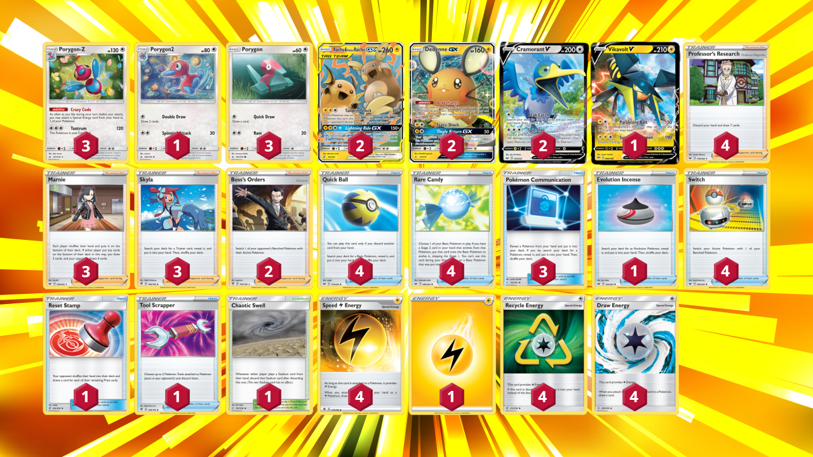
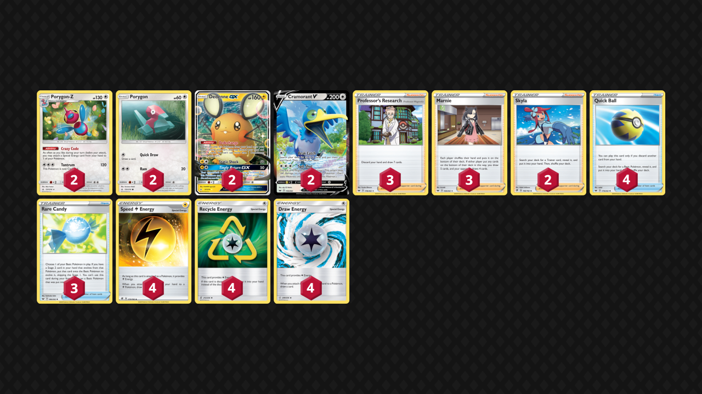

## Crazy Coders (Porygon-Z)

# Decklist:


# For PTCGO import:
```
Pokemon - 16
3 Porygon-Z UNB 157
1 Porygon2 UNB 156
3 Porygon UNB 155
2 Raichu & Alolan Raichu GX UNM 221
2 Dedenne GX UNB 195
2 Cramorant V SSH 155
1 Vikavolt V DAA 60

Trainer - 31
4 Professor's Research SSH 178
3 Marnie SSH 169
3 Skyla RCL 166
2 Boss's Orders RCL 154
4 Quick Ball SSH 179
4 Rare Candy GRI 165
3 Pokemon Communication TEU 152
1 Evolution Incense SSH 163
4 Switch PRC 163
1 Reset Stamp UNM 253
1 Tool Scrapper RCL 208
1 Chaotic Swell CEC 187

Energy - 13
4 Speed Lightning Energy RCL 173
1 Lightning Energy
4 Recycle Energy UNM 257
4 Draw Energy CEC 271
```

# Card Choices
## Skeleton

```
Pokemon
2 Porygon-Z
2 Porygon
2 Dedenne GX
2 Cramorant V
 
Trainers
3 Professor's Research
3 Marnie
2 Skyla
4 Quick Ball
3 Rare Candy
 
Energy
4 Speed Lightning
4 Recycle
4 Draw
```

## Discussion
### Pokemon
- Porygon line
    - The absolute minimum is a 2-0-2 line. I chose a 3-1-3 line to ensure that I can get it consistently around turn 2 or 3. Running 4-1-4 would increase the odds even more but after getting 1 porygon, the rest are just dead cards. 
- Cramorant V
    - This is the main attacker in the deck. Being able to hit anything for 160 every turn is very effective. The perfect amount for one-shotting dedennes and 320 over two turns takes care of everything except for VMAX Pokemon. A great way to abuse recycle energy.
- Other Attackers
    - Electric types seem to be the way to go. Raichu Tag Team is a great choice with constant paralysis setting up two shots that can be hunted down by Cramorant V. It's GX attack also cleans up nicely.
    - Vikavolt V hits for 190 to help clean up VMAX Pokemon. It's first attack is also great in many situations.
- Potential Techs
    - Mawile GX: Punishes your opponent for holding Dedenne. 
    - Jirachi: Helps you get your Porygon-Z out quicker.

### Trainers
- Supporters
    - Skyla is great in the deck when you have draw from energy. It would warrant running 4 if you could play supporters when going first. 3 seems to be enough for now.
    - Marnie is only a good supporter in the mid-late game as you aim to build up a big hand early game with attachments. Busted card though.
    - Boss's Orders is not necessary in the deck. You can snipe for 160 anyways. Still, it is a great card for chasing KOs on tanks with your other main attackers. 2 seems like enough.
- Items
    - 4 Rare Candy/3 Communication/1 Incense. Trying to maximise the turn 2 Porygon-Z. Could go for a 2/2 Communication/Incense split but Communication has more versatility even though it is one extra card to use.
    - 4 Switch. This is mainly for Raichu Tag Team to get consecutive paralysis.
- Stadiums
    - 1 Chaotic Swell. Preventing stadiums from sticking is sometimes necessary, protect yourself from the Wondorous Labyrinth tech or disrupt your opponent from grabbing energy with Giant Hearth. 

### Energy
- Speed/Draw
    - This is what makes the deck good. I've had games where I draw 20 cards on turn 2 with Professor's Research, Dedenne-GX and Speed + Draw Energy attachments. It helps your early game tremendously and can save your late game as well.
- Recycle
    - The main energy of use. Unfortunately, it will often be the case that you attack with Cramorant V with 3 Recycle and then they get Marnie'd to the bottom of your deck. Hard to prevent this, but you can draw back into them. 
- 1 Lightning. 
    - 4 Speed is too little to rely on to power up your attackers. This fifth energy helps you use your other attacks.
