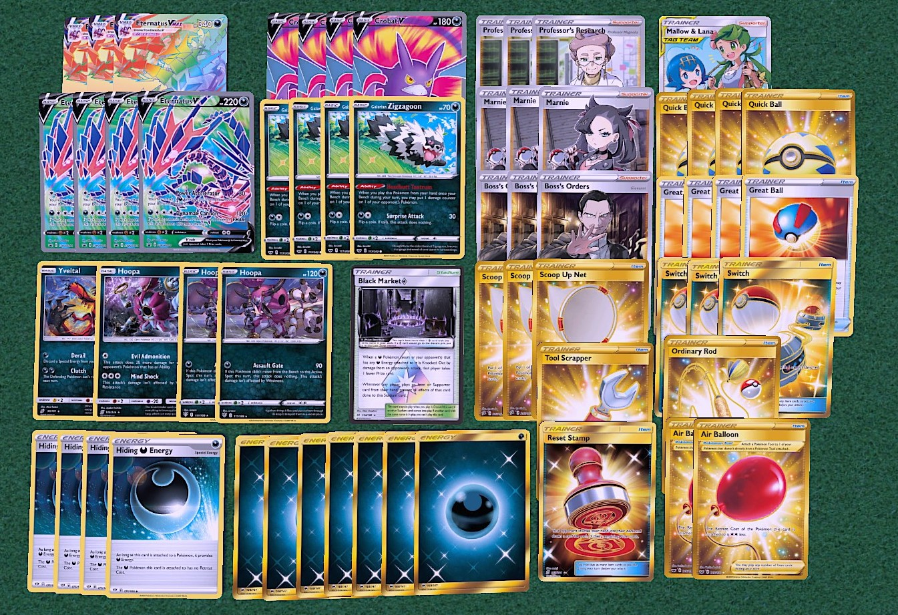

## Deck Name

[Back](https://joeygaffney.github.io/teamlit/res/decklists)

# Decklist:


# For PTCGO import:
```
Pokemon - 19
3 Eternatus VMAX DAA 117
4 Eternatus V DAA 116
4 Crobat V DAA 104
4 Galarian Zigzagoon SSH 117
1 Yveltal TEU 95
2 Hoopa DAA 111
1 Hoopa UNM 140

Trainer - 30
3 Professor's Research SSH 178
3 Marnie SSH 169
3 Boss's Orders RCL 154
1 Mallow & Lana CEC 198
4 Quick Ball SSH 179
4 Great Ball SSH 164
3 Scoop Up Net RCL 165
3 Switch PRC 163
2 Air Balloon SSH 156
1 Reset Stamp UNM 253
1 Ordinary Rod SSH 171
1 Tool Scrapper RCL 208
1 Black Market Prism Star TEU 134

Energy - 11
4 Hiding Darkness Energy DAA 175
7 Dark SSH D
```

# Card Choices
## Skeleton
```
Pokemon
3 Eternatus VMAX
4 Eternatus V
4 Galarian Zigzagoon
4 Crobat V

Trainers
3 Professor's Research
3 Marnie
3 Boss's Orders
4 Quick Ball
4 Great Ball
2 Scoop Up Net
1 Black Market Prism Star
1 Ordinary Rod

Energy
4 Hiding Darkness
6 Dark
```

## Discussion
### Pokemon
- 4 of each core basic makes it easier to hit max damage.
- **Yveltal TEU** is good for its natural free retreat and special energy removal.
- **Hoopa** is a good dark attacker.
- **Potential Techs**:
    - **Galarian Weezing**: for the mirror matchup to force your opponent to constantly discard their bench to 5.

### Trainers
- **Supporters**
    - **3 Professor's Research/3 Marnie** is a bit low but you play 4 Crobat V to compensate.
    - **3 Boss's Orders** is very necessary. Chasing knock outs wins you games.
    - **Mallow & Lana** is to prevent two-shots for a big swing turn.
- **Items**
    - **3 Scoop Up Net**, you could get away with 2 but the extra ping is nice.
    - **Air Balloon is for when you can't afford to attach a Hiding energy.
    - **Potential Techs:**
        - **Turbo Patch/Energy Switch**: a good combo to pull attacks out easier.
- **Stadiums**
    - **Black Market Prism Star** is a great stadium that makes your Hoopas OP.

### Energy
- Pretty standard. 11 total makes it so you don't whiff attachments early on.

[Back](https://joeygaffney.github.io/teamlit/res/decklists)