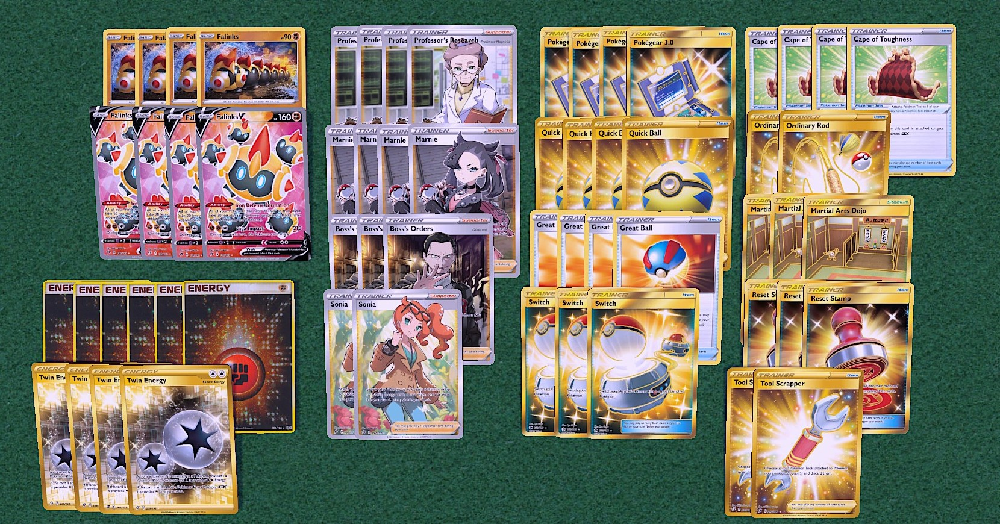

## Deck Name

[Back](https://joeygaffney.github.io/teamlit/res/decklists)

# Decklist:


# For PTCGO import:
```
Pokemon - 8
4 Falinks RCL 109
4 Falinks V RCL 110

Trainer - 42
4 Professor's Research SSH 178
4 Marnie SSH 169
3 Boss's Orders RCL 154
2 Sonia RCL 167
4 Pokegear 3.0 SSH 174
4 Quick Ball SSH 179
4 Great Ball SSH 164
4 Cape of Toughness DAA 160
3 Switch PRC 163
2 Ordinary Rod SSH 171
3 Martial Arts Dojo UNB 179
3 Reset Stamp UNM 253
2 Tool Scrapper RCL 208

Energy - 10
4 Twin Energy RCL 174
6 Fighting SSH F

```

# Card Choices
## Skeleton
```
Pokemon
4 Falinks
4 Falinks V

Trainers
4 Professor's Research
4 Marnie
3 Boss's Orders
2 Sonia
4 Quick Ball
4 Cape of Toughness
2 Ordinary Rod

Energy
4 Twin
4 Fighting

```

## Discussion
### Pokemon
- Falinks/Falinks V. You do not need to run any other Pokemon in the deck. With 4 Falinks V and a Cape, your regular Falinks have the equivalent of 220HP and your Falinks V become tanks with 290HP.

### Trainers
- **Supporters**
    - Boss's Orders. You could run 4 however I didn't see it as necessary. 3 is enough for 3 Crobat V/Dedenne GX.
    - Sonia is a great card. Search for 2 Falinks V means you take 40 less damage and do 60 more. The option to search for energy in the mid-late game is also useful.
- **Items**
    - Quick Ball/Great Ball. If there was a better option instead of Great Ball, I would pick that. They will fail 80% of the time in the early game but become a bit better when your deck is thinner and you rod in some Falinks.
    - Reset Stamp wins games. You can play them early for extra disruption and still easily find them late game once a few Falinks have fallen.
- **Stadiums**
    - Martial Arts Dojo lets you one-shot Eternatus VMAX if you are behind on prizes. You need to attach a fighting energy but it's definitely worth it.

### Energy
- 6 Fighting sometimes feels like too much. You could get away with 4 but being able to draw into them without having to rely on Sonia is nice to have.

[Back](https://joeygaffney.github.io/teamlit/res/decklists)