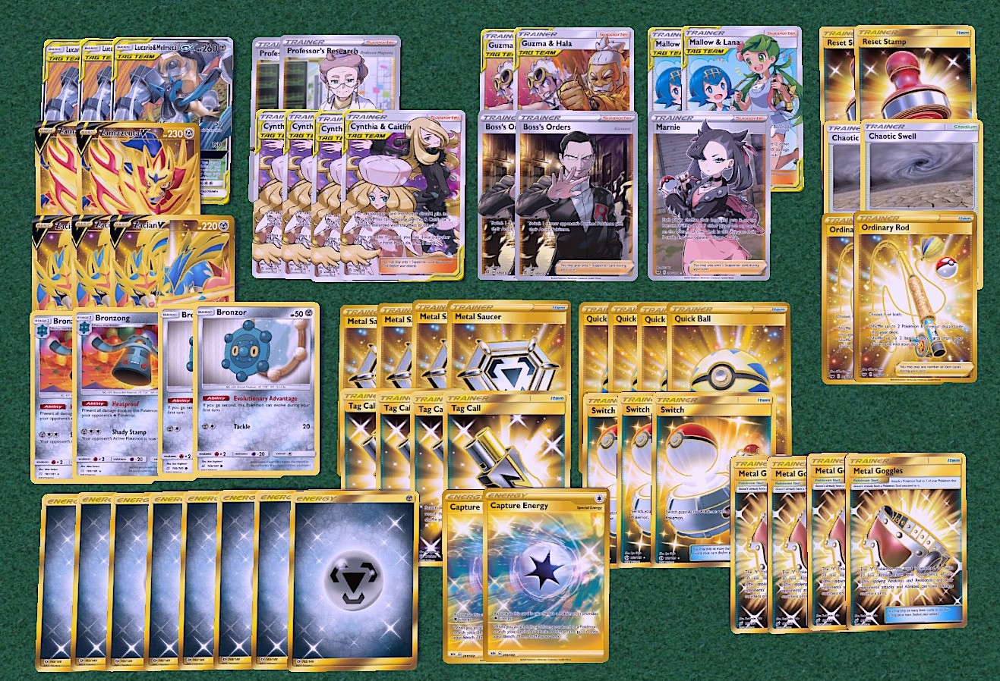

## Lucario Melmetal

[Back](https://joeygaffney.github.io/teamlit/res/decklists)

# Decklist:


# For PTCGO import:
```
Pokemon - 12
3 Lucario & Melmetal-GX UNB 120
2 Zamazenta V SSH 212
3 Zacian V SSH 138
2 Bronzong TEU 101
2 Bronzor TEU 100

Trainer - 
2 Professor's Research SSH 178
4 Cynthia & Caitlin CEC 189
2 Guzma & Hala CEC 193
2 Boss's Orders RCL 154
2 Mallow & Lana CEC 198
1 Marnie SSH 169
4 Metal Saucer SSH 170
4 Metal Goggles TEU 195
4 Quick Ball SSH 179
4 Tag Call CEC 206
3 Switch PRC 163
2 Ordinary Rod SSH 171
2 Reset Stamp UNM 253
2 Chaotic Swell CEC 187

Energy - 10
2 Capture Energy RCL 171
8 Metal SSH M
```

# Card Choices
## Skeleton
```
Pokemon
2 Lucario & Melmetal-GX
2 Zacian V
1 Bronzong
1 Bronzor
1 Zamazenta V

Trainers
2 Cynthia & Caitlin
2 Guzma & Hala
2 Mallow & Lana
3 Tag Call
4 Metal Saucer
3 Quick Ball
3 Metal Goggles

Energy
2 Capture Energy
8 Metal
```

## Discussion
### Pokemon
- At the bare minimum you can run reduced counts of any of the attackers. The Pokemon line is very flexible in general. 
- **Potential Techs**:
    - **Duraludon RCL 138** wins the decidueye matchup since they do zero damage with goggles on.
    - **Meltan/Melmetal-GX SM178** has the equivalent of 310HP with Goggles and Full Metal Wall activated. Good as a Stage 1 attacker if afraid of Goons.

### Trainers
- **Supporters**
    - You can choose the high counts of Tag Team supporters yourself. Cynthia & Caitlin is a cop out, allowing you to just reuse the supporters you want to. Running extra Mallow & Lana or Marnie depends on the meta you expect.
- **Items**
    - **Metal Goggles** is the lifeblood of this deck. While Tool Scrappers are low in count in decks, this will be a good deck.
    - **Tag Call** engine works fine
    - **4 Quick Ball** is unnecessary, having a way to search Bronzong would be better. A 2/2 or 3/2 split of Quick Ball/Communication is ideal.
- **Stadiums**
    - **Chaotic Swell** is decent and gives another target for Guzma & Hala.

### Energy
- **Capture** turn 1 on Melmetal into Zacian draw if first or Full Metal Wall if second is great. Not necessary though so I only play 2. 

[Back](https://joeygaffney.github.io/teamlit/res/decklists)