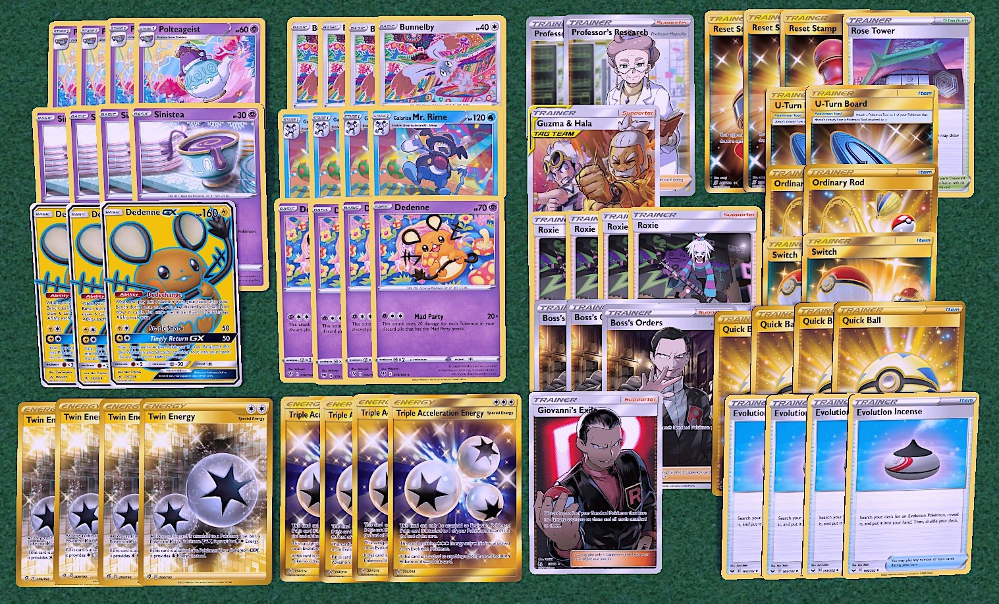

## Mad Party

[Back](https://joeygaffney.github.io/teamlit/res/decklists)

# Decklist:


# For PTCGO import:
```
Pokemon - 23
4 Polteageist DAA 83
4 Sinistea DAA 82
4 Bunnelby DAA 150
4 Galarian Mr.Rime DAA 36
4 Dedenne DAA 78
3 Dedenne GX UNB 57

Trainer - 29
1 Rose Tower DAA 169
2 Professor's Reasearch SSH 178
1 Guzma & Hala CEC 193
4 Roxie CEC 205
3 Boss's Orders RCL 154
1 Giovanni's Exile UNB 174
3 Reset Stamp UNM 253
2 U-Turn Board UNM 211
2 Ordinary Rod SSH 171
2 Switch PRC 163
4 Quick Ball SSH 179
4 Evolution Incense SSH 163

Energy - 8
4 Triple Acceleration Energy UNB 190
4 Twin Energy RCL 174
```

# Card Choices
## Skeleton
```
Pokemon
3 Dedenne-GX
4/4/4/4/4 Mad Party Stuff

Trainers
4 Roxie
4 Quick Ball
4 Evolution Incense

Energy
4 Triple Acceleration Energy
4 Twin Energy
```

## Discussion
### Pokemon
- **3 Dedenne-GX** is fine. 4 is overkill and increases the chances of starting with it.
- With a 20 Pokemon card base, it is hard to fit in more techs. Buuuut,
- **Potential Techs:**
    - **Spiritomb TEU 89**. This discards 4 Pokemon to ramp up damage quickly. Unfortunately it costs energy and often you discard enough to hit for decent damage early on anyways.
    - **Jirachi TEU 99**. Not as good without escape boards. Could be worth the include if you put in Scoop Up Nets.
    - **Weezing CEC 77**. For Roxie damage. Might be worth it if there is a matchup where you try to dig for one-shots with the extra 10 damage.
    - **Oricorio-GX** for Stamp immunity. 

### Trainers
- **Supporters**
    - **4 Roxie** is the best card in this deck. Drawing 6 cards while getting those Mad Partyers in your discard is the best engine in the format.
    - **2 Professor's Research**. Surprisingly, you often end up with very large hands due to Roxie that you do not want to discard. For the times that you do want to discard your hand, Dedenne-GX is usually a go to anyways. Thus, 2 is enough.
    - **Guzma & Hala**. It's an expensive energy search. Might be the worst card in the deck most of the time. Comes in handy sometimes.
    - **3 Boss's Orders**. You should definitely run 3. 
    - **Giovanni's Exile** is a good tech to drop 2 polteageist for the extra 40 damage late game. You can also discard Dedenne-GX to free up your bench or prevent easy prizes.
- **Items**
    - **3 Reset Stamp** makes up for 0 Marnie.
    - **U-turn Board** is very handy
    - **2 Ordinary Rod** is the largest amount you would ever need to play in a game.
- **Stadiums**
    - **Rose Tower** is not very good but it is a target for Guzma & Hala. It is meant to counter Wondorous Labyrinth, you could also just play a Chaotic Swell.

### Energy
- **4 Triple Acceleration/4 Twin** is necessary. You will need at most 3 energy for 3 prizes. I would not run less than this.

[Back](https://joeygaffney.github.io/teamlit/res/decklists)